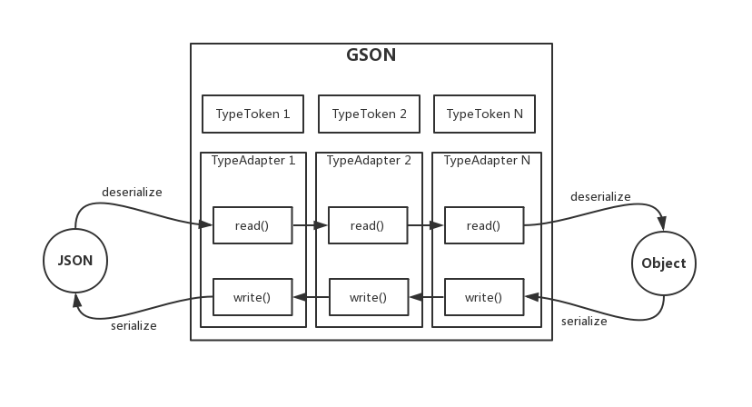
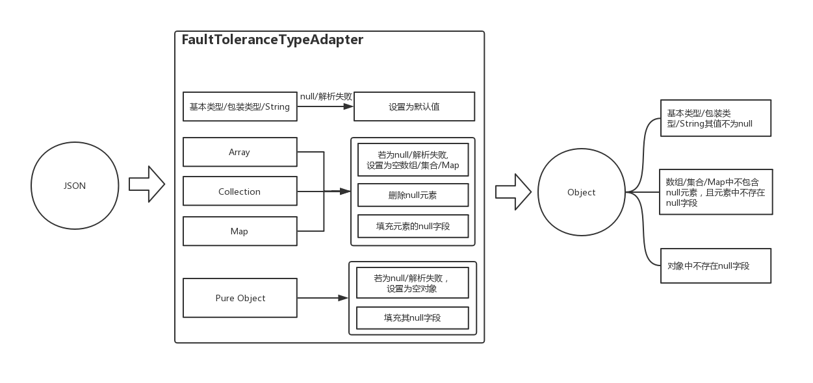
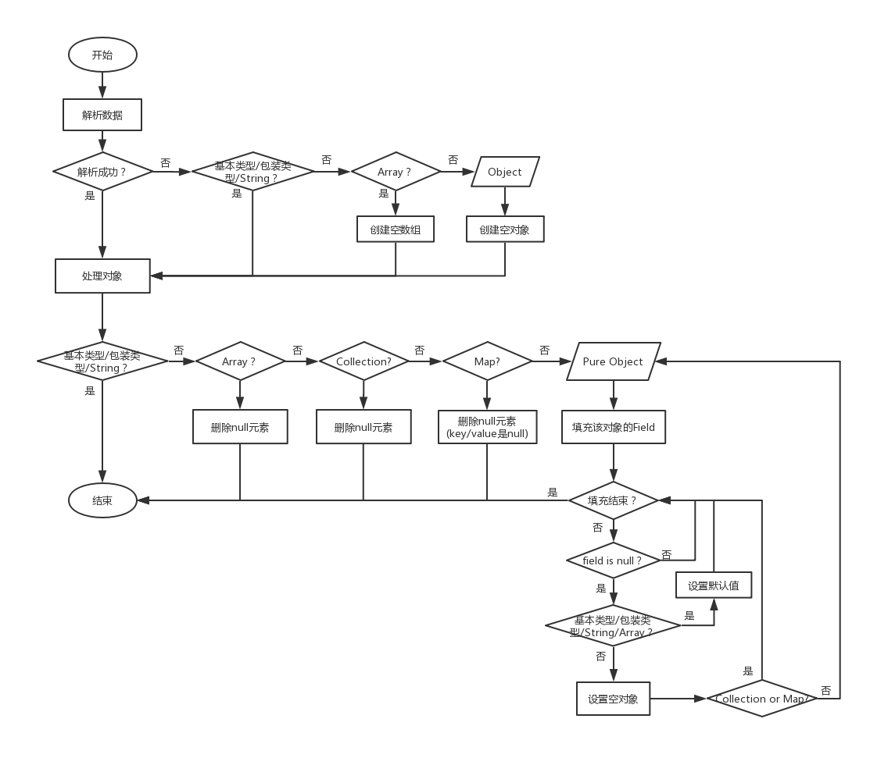

[TOC]

该库主要提供json解析的容错功能，避免解析生成的对象中包含null值，其对外暴露的api主要包括以下类：

* `GsonWrapper`: 提供json生成/解析功能。
* `Logger`: 用于本库的日志输出，默认不打印日志。
* `DefaultValues`: 提供获取基本类型和String类型的默认值的功能。
* `FaultToleranceAdapterFactory`: 提供gson容错功能的AdapterFactory

# 0x00 NOT SUPPORT

**注意：使用集合时，必须指定其具体类型，禁止在待解析的类中出现`Object`或其他基类字段。**

1. 如`List<Object>、Map<Object, Object>、Map<String, Object>、List<BaseData>、Map<String, BaseData>`等均是非法的。

2. 如`List<String>，List<Data>`则是合法的。

具体例子参考测试代码中的[GsonWrapperTest](./src/test/java/com/coofee/wrapper/gson/test/GsonWrapperTest.java)，待解析类可以参考[Response](./src/test/java/com/coofee/wrapper/gson/test/bean/Response.java)、[Data](./src/test/java/com/coofee/wrapper/gson/test/bean/Data.java)、[BaseData](./src/test/java/com/coofee/wrapper/gson/test/bean/BaseData.java)等类

# 0x01 GsonWrapper

当`GsonWrapper`解析json时，其返回的对象要么是null，要么是object（且object中的字段不存在null值），可以使用如下方式添加依赖：

```gradle
repositories {
    mavenCentral()
    jcenter()
    maven {
        url "https://orgcoofee.bintray.com/coofee"
    }
}

dependencies {
    compile 'com.coofee.wrapper:gson:<lastest-version>'
}
```

## 1. 基础用法

解析/生成json与gson库的api一致，均使用`fromJson()`和`toJson()`方法。

* 生成json

通过调用`toJson()`方法生成json，如下所示：

```java
final String dataJson = GsonWrapper.toJson(new Response<Data>());
```

* 解析json

通过调用`fromJson()`方法解析json，如下所示：

```java
final Response<Data> dataResponse = GsonWrapper.fromJson(dataJson,
    new TypeToken<Response<Data>>(){}.getType());

if (dataResponse == null) {
    // 要么是null
} else {
    // 要么所有字段均不为null
}
```

* 日志打印

默认不打印日志，可通过调用`setLogImpl()`方法来设置日志打印(注意：为了方便追踪问题，`GsonWrapper.fromJson()`函数中的错误日志不受`enableLog()`函数控制)，如下所示：

```java
Logger logImpl = new Logger() {

    @Override
    public boolean enableLog() {
        return true;
    }

    @Override
    public void d(String tag, String msg) {

    }

    @Override
    public void e(String tag, String msg) {

    }

    @Override
    public void e(String tag, String msg, Throwable e) {

    }
};
GsonWrapper.setLogImpl(logImpl);
```

## 2. 默认值说明

| 类型 | 默认值 | 说明 |
|:--:|:--:|:--:|
| int/Integer | 0 | |
| boolean/Boolean | false | |
| char/Character | 0 | |
| byte/Byte | 0 | |
| short/Short | 0 | |
| long/Long | 0 | |
| float/Float | 0 | |
| double/Double | 0 | |
| String | "" | |
| 对象 | 空对象 | 不包含null字段 |
| 数组 | 空数组 |  |
| 列表 | 空列表 |  |
| 字典 | 空字典 | |


**注意：容错提供的默认值，仅当未对字段进行初始化赋值时生效，如下所示：**

```java
class Data {
    // 解析Data时，如果没有code字段或者code字段解析失败，则code字段的值就是-1。
    int code = -1;

    // 解析Data时，如果没有refCode字段或者refCode字段解析失败，则refCode字段的值就是0。
    Integer refCode;
}
```


## 3. 自定义gson支持容错

如果需要自定义了gson，同时需要使用本库提供的容错功能，可以对`GsonBuilder`进行如下配置：

```java
gsonBuilder.registerTypeAdapterFactory(new FaultToleranceAdapterFactory())
```

# 0x02 设计说明

## 1. GSON解析流程



## 2. 容错设计

* 框图




* 流程图

